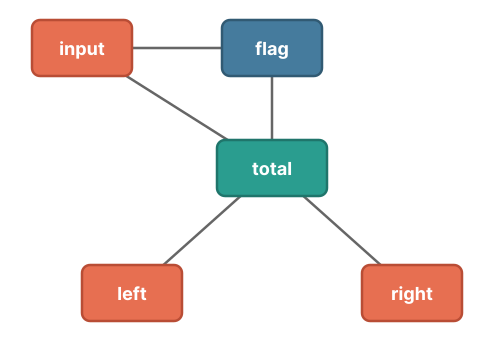

<small>

🌐 [この記事を日本語で読む](https://zenn.dev/sapphi_red/articles/636d34f84494fb)

</small>

This article explains how variable mangling works in [Oxc Minifier](https://oxc.rs/docs/guide/usage/minifier).

## What is variable mangling?

First, let's explain what variable mangling is.

Variable mangling is a type of minification that reduces code size by replacing variable names with shorter ones.

For example, it transforms this code:

```js
const foo = 1
export function bar(baz) {
  return foo + baz
}
```

into:

```js
const a = 1
export function bar(b) {
  return a + b
}
```

In this example, the code is reduced by 8 characters.

## A rough overview

### Requirements and basic strategy

The most important requirement for variable mangling is that it must not change the meaning of the code. For example, renaming multiple variables in the same scope to the same name would change the meaning of the code. More specifically, a transformation like the following must not happen:

```js
// Input
const foo = 1
const bar = 2
export const baz = foo + bar

// Output
const a = 1
const a = 2 // !
export const baz = a + a
```

At the same time, the purpose of variable mangling is to make the code shorter. Oxc Minifier places particular emphasis on reducing the size after compression with gzip or similar compression algorithms.

To achieve this while preserving the meaning of the code, variable mangling follows these strategies:

1. Reuse the same variable names as much as possible.
2. Use variable names that are as short as possible.

From here on, we'll use the following code as an example to explain how Oxc Minifier achieves these goals:

<!-- prettier-ignore-start -->

```js
export function demo(input, flag) { // Scope: SA
  let total = input
  if (flag) { // Scope: SB1
    let left = total + 1
    use(left)
  }
  if (!flag) { // Scope: SB2
    let right = total + 2
    use(right)
  }
  return total
}
```

<!-- prettier-ignore-end -->

Here, SA is the scope of the `demo` function body, while SB1 and SB2 are the scopes of the two `if` blocks.

### Step 1: Calculate symbol liveness

First, we calculate the liveness of each symbol. A symbol's liveness is the set of scopes in which that symbol can be referenced. Note that this does **not** mean "the range in which the value of the variable may be used later."

The liveness of each symbol in the example is as follows:

| Variable | Liveness        |
| :------- | :-------------- |
| `input`  | \{SA}           |
| `flag`   | \{SA}           |
| `total`  | \{SA, SB1, SB2} |
| `left`   | \{SB1}          |
| `right`  | \{SB2}          |

### Step 2: Assign slots

Next, let's introduce the concept of a "slot". A slot is a group of variables that can be assigned the same name after mangling. For example, if variables `a` and `b` are assigned to the same slot, they will have the same name after mangling.

We then assign each variable to a slot, starting with variables declared in shallower scopes. As long as their liveness does not overlap, a variable is added to an existing slot. This achieves the first strategy: reusing the same variable names as much as possible.

The reason for processing variables declared in shallower scopes first is that variables declared in deeper scopes have a smaller possible liveness range. Intuitively, when assigning a variable from a deeper scope later, its liveness is less likely to overlap with variables that have already been assigned, making it easier to reuse an existing slot.

For the example, the variables are assigned to slots as follows:

| Slot | Variables assigned to the slot |
| ---- | ------------------------------ |
| 0    | `input`, `left`, `right`       |
| 1    | `flag`                         |
| 2    | `total`                        |

`input` is live only in scope SA, and is not live in SB1 or SB2. Meanwhile, `left` and `right` are not live in SA. Therefore, they can all be assigned to the same slot.

In other words, there is no problem with `left` or `right` shadowing `input`, so they can share a slot with `input`.

### Step 3: Generate variable names

Next, we generate a variable name for each slot. This achieves the second strategy: using variable names that are as short as possible.

Variable names use alphabets, digits, `_`, and `$`. Among the characters that can be used in variable names, these can all be represented with a single byte in UTF-8. Other characters require two or more bytes in UTF-8, so in terms of code size, there is no advantage over using multiple single-byte characters. Also, alphabets and digits already appear frequently in JavaScript code, so using these characters tends to work better when the code is compressed with gzip or similar algorithms.

The characters are used in the following order (digits are only used from the second character onward):

```
etnriaoscludfpmhg_vybxSCwTEDOkAjMNPFILRzBVHUWGKqJYXZQ$1024368579
```

This ordering is based on the frequency of each character in a corpus created by concatenating the minified output of bundles from several libraries. The goal is to approximate the character frequency of minified code and improve the compression efficiency of the final code.

Next, the number of characters to use for each slot's variable name is determined based on how frequently the variables in that slot appear in the code. For example, the most frequently occurring slot gets a one-character name, while the 100th most frequently occurring slot gets a two-character name.

After that, variable names of the required length are assigned according to the order in which the variables in each slot appear.

For the example, the variable names assigned to each slot are as follows:

| Slot | Variable name | Variables assigned to the slot |
| ---: | :------------ | :----------------------------- |
|    0 | e             | `input`, `left`, `right`       |
|    1 | t             | `flag`                         |
|    2 | n             | `total`                        |

This gives us the following final code:

```js
export function demo(e, t) {
  let n = e
  if (t) {
    let e = n + 1
    use(e)
  }
  if (!t) {
    let e = n + 2
    use(e)
  }
  return n
}
```

## A deeper look at the algorithms using mathematical concepts

From here on, for those who want to know more about the details, let's take a deeper look at the algorithms using some concepts from mathematics.

### Scopes and symbol liveness

JavaScript scopes form a tree structure. There is a module scope, and the scopes contained within the module, for example, the scope of an `if` block, are descendants of that module scope.

The liveness of a variable forms a subtree of this scope tree. If a variable can be referenced from two scopes, it can also be referenced from every scope on the path between them in the scope tree.

```js
let foo = 0
{
  // foo can also be referenced here.
  // If foo were declared here instead,
  // foo above would no longer be accessible
  // from the block below.

  {
    console.log(foo)
  }
}
```

### The slot assignment algorithm

The goal of slot assignment is to assign all variables using as few slots as possible.

It turns out that this can be viewed as a graph coloring problem where we want to color the vertices using the minimum number of colors. We construct a graph where each vertex represents a variable, and an edge connects two variables if their liveness overlaps. Each color then corresponds to a slot. For the example, the graph looks like this:


Furthermore, this graph is an intersection graph of subtrees. The liveness of each variable is a subtree, and an edge represents an intersection between two such subtrees. It is known that intersection graphs of subtrees are _chordal graphs_.

For general graphs, finding an optimal coloring is NP-hard. However, it is known that chordal graphs can be optimally colored in polynomial time. For a chordal graph, the minimum number of colors required is also equal to the size of its maximum clique. In this case, that corresponds to the maximum number of variables that are live at the same time in any single scope.

The order in which Oxc Minifier processes variables, from variables declared in shallower scopes to those declared in deeper scopes, is the reverse of a _Perfect Elimination Ordering_ of this graph. It is known that greedily coloring a chordal graph in this order produces a coloring using the minimum number of colors.

In other words, under this model, Oxc Minifier's slot assignment algorithm achieves the minimum possible number of slots.

## Wrapping up

In practice, there are additional cases to handle, such as variables whose original names must be preserved, but this is the basic mechanism behind variable mangling in Oxc Minifier.

I've explained everything as if I knew all of this from the beginning, especially the part about chordal graphs, but that's not actually what happened. I first wrote the code based on intuition, and it happened to use the reverse of a Perfect Elimination Ordering. I only realized this later when I tried to understand theoretically why the algorithm worked 🙂

A friend also helped me check the more detailed explanation in the latter half of this article. Thanks!
