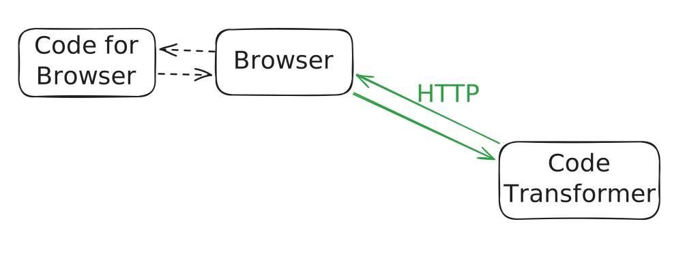
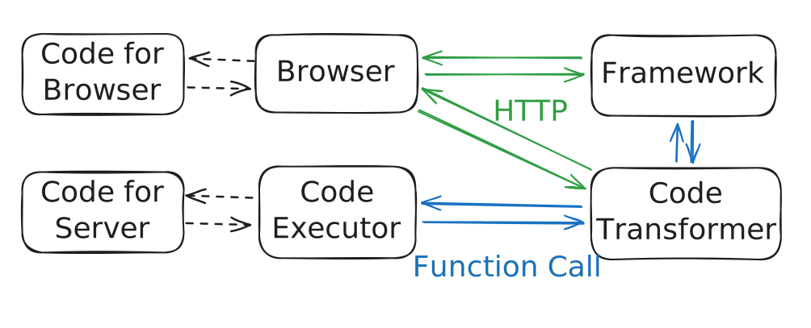
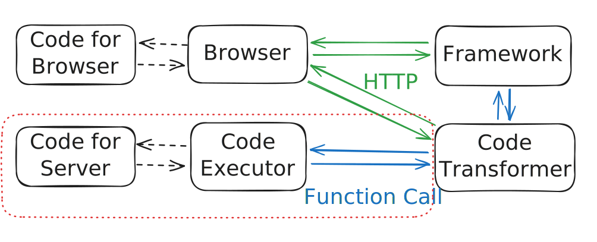
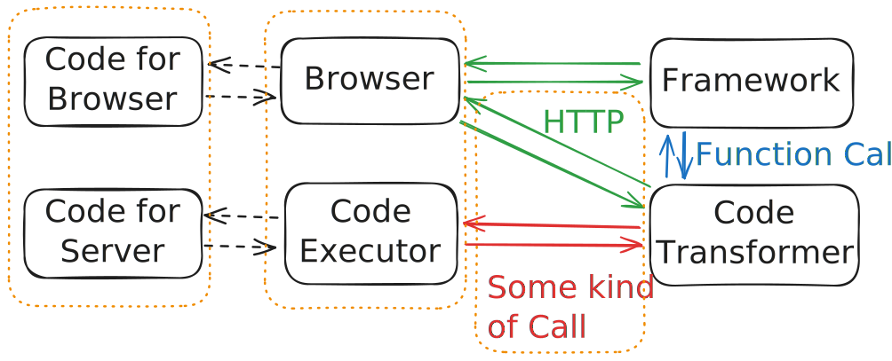
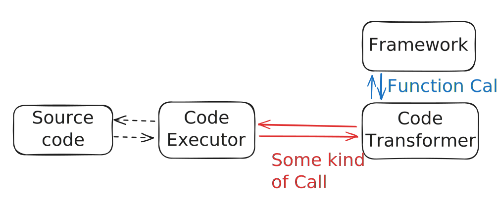
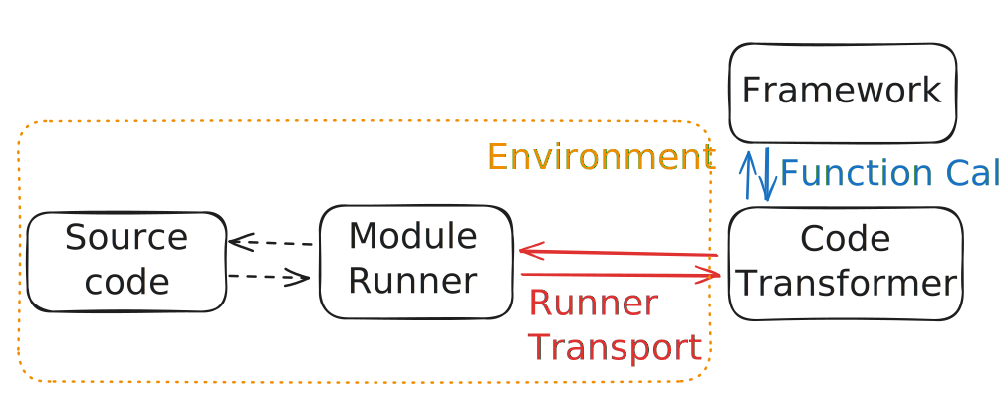
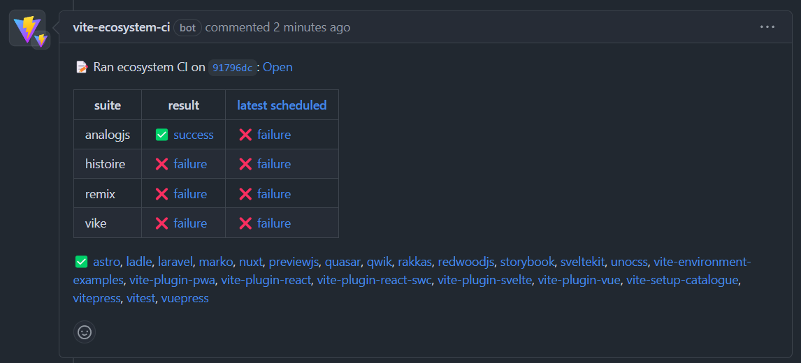

<ArticleTitle />

// TODO: make an OGP image  
// TODO: make images work with light theme  
// TODO: fix unstable twitter widget

This post is an translation of the original talk in Japanese. The slides for the original talk are available [here](https://pre-vue-fes-2024-environment-api-slide.sapphi.red/) (Japanese).

This post describes what the Environment API is, a major feature that is going to be introduced in [Vite](https://vite.dev/) v6.

## The evolving JS ecosystem

Vite's first official release was in February 2021, and today it has been almost three and a half years.
During these 3.5 years, the JS ecosystem has changed.

<figure>
  <LineChart :height="300" :data="{
    labels: ['2020', '2021', '2022', '2023'],
    datasets: [
      {
        label: 'Node.js',
        backgroundColor: '#417e38',
        borderColor: '#417e38',
        data: [80.1, 71.5, 70.9, 74.3],
      },
      {
        label: 'Deno',
        backgroundColor: '#70ffaf',
        borderColor: '#70ffaf',
        data: [5.2, 5.6, 8.5, 11.9],
      },
      {
        label: 'Bun',
        backgroundColor: '#e8c98c',
        borderColor: '#e8c98c',
        data: [,,3.2, 17.4],
      },
      {
        label: 'Vercel Edge Runtime',
        backgroundColor: isDark ? '#ffffff' : '#000000',
        borderColor: isDark ? '#ffffff' : '#000000',
        data: [,,10.4, 15.8],
      },
      {
        label: 'Cloudflare Workers',
        backgroundColor: '#f63',
        borderColor: '#f63',
        data: [,,7.5, 10.6],
      },
    ],
  }" :options="{
    scales: {
      y: {
        title: {
          display: true,
          text: 'Usage (%)',
        },
        min: 0,
      },
    },
  }" />
  <figcaption>Data based on <a href="https://stateofjs.com/en-US">State of JavaScript</a></figcaption>
</figure>

First, runtimes other than [Node.js](https://nodejs.org/en) have emerged.
This graph shows the usage rate of each runtime as collected by State Of JS.
[Deno](https://deno.com/) has been gradually increasing since the release of Vite in 2021, and other runtimes have also been increasing since 2022, when the data is available.
In 2023, all of these runtimes have usage rates above 10% and are expected to continue to grow in the coming years.

Second, a single application now needs to handle multiple bundles.
At the end of 2020, [React Server Components were announced](https://react.dev/blog/2020/12/21/data-fetching-with-react-server-components): to use React Server Components, you will need a bundle for RSC, separate from the client bundle for the browser and the SSR bundle for doing SSR.
This means that up to three different bundles need to be handled.
Additionally, separate bundles are becoming necessary to run some of the functions of the application on different servers.
Examples are [the middleware feature](https://nextjs.org/docs/app/building-your-application/rendering/edge-and-nodejs-runtimes) added to Next.js in 2022 and the ability to specify a runtime for each page that exists in [Next.js](https://nextjs.org/docs/app/api-reference/file-conventions/route-segment-config#runtime) and [SvelteKit](https://kit.svelte.dev/docs/adapter-vercel#deployment-configuration).
These features require the generation of separate bundles to run parts of the application in different locations or runtimes.

However, Vite assumed only a bundle for the browser and a bundle for SSR. Moreover, the bundle for SSR was assumed to run only in Node.js.

## Current Vite internal structure and changes in the Environment API

To explain what it means that Vite only assumed them, I'll show you the current internal structure of Vite. I'll focus only on the development step from here on, because the build step does not involve runtimes other than Node.js.

To begin with, in the case where the code is to be executed only in the browser without SSR, the structure looks like this.

To execute the code for the browser, the browser sends an HTTP request to Vite's code transformer, and the transformed code is executed by the browser.

Next, this is what happens when SSR is also performed.

When the framework receives an HTTP request from the browser, it calls a function exported from Vite.
This invokes Vite's code transformer, which transforms the code for the server and then Vite's code executor executes the transformed code.
It is important to note that both the code transformer and the code executor depend on Node.js.
Therefore, Vite could not be executed outside of Node.js.

For this reason, the Environment API has separated this red part and is designed to allow that part to be swapped.
In addition, it is now possible to have multiple red parts.

In order to allow the code executor to be swapped, the communication between the code transformer and the code executor can now be changed to any method, not just function calls.

As a result of allowing the server side below to be swapped, we notice that the processing for the browser code is essentially the same as the server code.

Therefore, it can be expressed in this concise form.

In the Environment API, the code executor is called "Module Runner" and the communication channel between the code transformer and the code executor is called "Runner Transport".

There are two things that are necessary to construct an Environment.
First, dynamic code evaluation, such as `eval`, must be available for the Module Runner to be configured.
Second, communication between ModuleRunner and the code conversion part of Vite must be possible.
For example, HTTP and standard I/O.
If these two requirements can be satisfied, an Environment for that runtime can be constructed.

## Possible usages of the Environment API

So what can you actually achieve with the Environment API?
Of course, it enables running on runtimes other than Node.js (e.g. [Deno](https://deno.com/), [Bun](https://bun.sh/), [workerd](https://blog.cloudflare.com/workerd-open-source-workers-runtime/), [Edge Runtime](https://edge-runtime.vercel.app/)) and bundling for those runtimes, as mentioned in the first section.

In addition, the old Node.js can be used.
Until now, the code transformer and the code executor have been integrated together.
Therefore, the required version of Node.js had to be increased to meet the requirements of the code transformer.
However, by separating the code execution part, it is now possible to construct environments for older Node.js versions.

It would also be possible to construct environments for other specialized runtimes such as [Electron](https://www.electronjs.org/), [Tauri](https://tauri.app/), [React Native](https://reactnative.dev/), and others.

In an extreme case, it is also possible to (1) run hono on Node.js as an origin server, and (2) run hono on Cloudflare Workers as an edge server, and (3) run hono on a service worker, and (4) run a script on browser. If I named this architecture, I'd call it "daienjo architecture" (Translation note: "hono" means "flame" in Japanese, and "daienjo" means "a huge flame" and also commonly means "an outrage on social media").

Here's a demo of the daienjo architecture.

<video controls>
  <source type="video/webm" src="./assets/vite-env-demo.webm" />
  <source type="video/mp4" src="./assets/vite-env-demo.mp4" />
  
You browser does not support playing a video. You can <a href="./assets/vite-env-demo.mp4">download</a> the video instead.

</video>

A automatic refresh happens when changing any codes for the browser, the service worker, the edge server, and the origin server.
In this demo, a refresh happens, but because the environment API supports HMR, if the framework or the render library has support for HMR, HMR will happen instead.
All codes are actually executed on the corresponding runtimes. For example, the code for the edge server is executed on workerd.

The build for all environment can be done in a single command (`vite build --app`) too.

- Site: https://daienjo-architecture.sapphi.red/
- Repository: https://github.com/sapphi-red/daienjo-architecture

In this demo, the service worker receives the request from the browser, calls the edge server, calls the origin server, and then returns the response, which is transformed by the edge and service worker.
But it is also possible to use a different runtime for each endpoint.

## The current state of the Environment API

The Environment API has already been merged into the main branch and released in v6.0.0-beta.0.

<blockquote class="twitter-tweet" :data-theme="isDark ? 'dark' : ''" data-cards="hidden">
✋ vite@6.0.0-beta.0 is out!  If you&#39;re building on top of Vite, experiment with the new Module Runner and Environment API and give us feedback! As a user, test compatibility so the ecosystem can smoothly upgrade to v6. Check out the docs to learn more ⚡️<a href="https://t.co/tak8pz77Vc">https://t.co/tak8pz77Vc</a>
&mdash; Vite ⚡ (@vite_js) <a href="https://twitter.com/vite_js/status/1834219516047294631?ref_src=twsrc%5Etfw">September 12, 2024</a></blockquote>

The ecosystem-ci (the CI that runs the tests in the ecosystem) that were run prior to the merge have passed mostly, and we are assuming that the existing code will continue to work.
We want to make the transition from v5 to v6 as smooth as possible to encourage users to upgrade.

We are planning to release the Environment API as an experimental feature in v6.

## Wrapping up

The Environment API enables support for different runtimes and multiple bundles.
It enhances the framework infrastructure tool aspect of Vite.

I don't expect it to be used directly by many users, but I think it's an interesting feature and would be happy to hear your feedback!
Even if you don't try it out, I would also like you to try to think of interesting environments.

The documentation is still rough, but will be a bit more organized in the next few weeks.

If you have any questions or feedback, feel free to ask on [GitHub discussions](https://github.com/vitejs/vite/discussions/16358) or [Discord](https://chat.vite.dev/).
