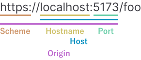
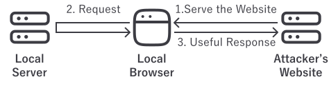

<!--
The images uses hugeicons.
It seems the attribution is not required but leaving a link here.
https://docs.hugeicons.com/icons-for-web/quick-start#features:~:text=No%20Attribution%20Required%3A%20Free%20for%20both%20personal%20and%20commercial%20use
-->

<small>

🌐 [この記事を日本語で読む](https://zenn.dev/articles/81f2aa7efbc5c7)

</small>

A great deal of time and effort is poured into the security of production servers. However, the security of local servers running on developers' machines is often overlooked. In fact, at the beginning of this year, I investigated, reported, and fixed vulnerabilities in several front-end development tools. This article, based on that experience and research, explains specific attack methods and the countermeasures to prevent them. If you're interested in the process of vulnerability investigation and response, please also read [the previous article](/blog/addressing-source-code-leaks-across-the-ecosystem-a-retrospective).

## Background Knowledge

First, let's cover the background knowledge necessary to understand the attack methods described later. Feel free to skip any topics you are already familiar with.

### URL and Its Components

In this article, the components of a URL are referred to as follows, in accordance with the [URL Standard](https://url.spec.whatwg.org/).

{.theme-supported .marign-center}

- **"Scheme"**
  - The name of the protocol
  - Can be obtained with `new URL(inputUrl).protocol`
  - Examples: `http:`, `https:`
- **"Hostname"**
  - A domain string or an IP address
  - Can be obtained with `new URL(inputUrl).hostname`
  - Examples: `www.example.com`, `127.0.0.1`, `[::1]`
- **"Port"**
  - The port number
  - Optional
  - Can be obtained with `new URL(inputUrl).port`
  - Example: `8080`
- **"Host"**
  - The combination of "hostname" and "port"
  - Can be obtained with `new URL(inputUrl).host`
  - Examples: `www.example.com:8080`, `192.168.0.1`
- **"Origin"**
  - The combination of "scheme," "host," and "port"
  - Can be obtained with `new URL(inputUrl).origin`
  - Examples: `http://www.example.com:8080`, `https://192.168.0.1`

### DNS (Domain Name System)

This is a system that translates domain strings into IP addresses.

### `Host` Header / `:Authority` Pseudo-Header

The [`Host` header](https://developer.mozilla.org/en-US/docs/Web/HTTP/Reference/Headers/Host) indicates which site a request is trying to access. It is used in HTTP/1.x. In HTTP/2 and later, the [`:Authority` pseudo-header](https://developer.mozilla.org/en-US/docs/Web/HTTP/Guides/Messages#pseudo-headers) is used instead. These headers specify the "host" part of the URL.

It's possible to send a request to a server just by using DNS to get the IP address from the URL's "hostname". These headers exist to specify which site to access when multiple sites are hosted on the same IP address.

### `Origin` Header

The [`Origin` header](https://developer.mozilla.org/en-US/docs/Web/HTTP/Reference/Headers/Origin) indicates which site a request was sent from. This header specifies the "origin" of the URL. It is controlled by the browser and cannot be manipulated by JavaScript on the site.

For example, if the following HTML is served from `http://example1.sapphi.red`, the `Origin` header for the request to `http://example2.sapphi.red/foo.js` will be `http://example1.sapphi.red`, not `http://example2.sapphi.red`.

```html
<html>
  <head>
    <script src="http://example2.sapphi.red/foo.js"></script>
  </head>
</html>
```

### Same-Origin Policy (SOP)

The [Same-Origin Policy](https://developer.mozilla.org/en-US/docs/Web/Security/Same-origin_policy) (SOP) is a browser security mechanism that restricts how a document or script loaded from one "origin" can interact with resources from another "origin."

For example, a `fetch` request from `http://example.com` to `http://example.sapphi.red` would be blocked by the browser by default because the "origins" are different.

This mechanism prevents unintentional requests from other sites, stopping them from reading your information or writing data via POST requests without permission.

## Attack Vectors

Now, let's explain the attack methods for each vulnerability I discovered. All these attacks aim to send a request from an external site to a local server, have the local server accept it, and receive a useful response.
For front-end development servers, a "useful response" would be one that reveals private server-side source code or pre-release features. Also, while it's bad practice, private source code might contain sensitive information in places that are expected to be stripped out during bundling, such as comments.

{.theme-supported .marign-center}

### 1. Overly Permissive CORS Settings

Requests from external sites are usually blocked by the browser's SOP, either by preventing the request itself or blocking the reading of the response. However, this is not the case if the [`Access-Control-Allow-Origin` header](https://developer.mozilla.org/en-US/docs/Web/HTTP/Reference/Headers/Access-Control-Allow-Origin) is set to explicitly allow cross-origin requests. Utilizing resources from different "origins" this way is called [Cross-Origin Resource Sharing](https://developer.mozilla.org/en-US/docs/Web/HTTP/CORS) (CORS).
Many development servers were configured with `Access-Control-Allow-Origin: *`, which allows requests from all "origins."

Here are the specific attack steps:

1. An attacker serves a malicious site (e.g., `http://malicious.example.com`).
2. A user accesses a site that executes JavaScript served by the malicious site. This isn't limited to top-level navigation; it includes embedding via iframes or scripts on external sites.
3. The served JavaScript executes `fetch('http://127.0.0.1:3000/main.js')`, and the response content is sent to the attacker.
4. The attacker receives the contents of `http://127.0.0.1:3000/main.js`.

In the case of a development server, `main.js` is a transpiled file, but often the source code exists within that file or in `main.js.map`, allowing the original source code to be retrieved.

::: tip Related

- Vite: [`GHSA-vg6x-rcgg-rjx6` / `CVE-2025-24010`](https://github.com/vitejs/vite/security/advisories/GHSA-vg6x-rcgg-rjx6) ([1]: Permissive default CORS settings)
- parcel: [Fix PR](https://github.com/parcel-bundler/parcel/pull/10138)
- esbuild: [`GHSA-67mh-4wv8-2f99`](https://github.com/evanw/esbuild/security/advisories/GHSA-67mh-4wv8-2f99)
- Next.js: [`GHSA-3h52-269p-cp9r` / `CVE-2025-48068`](https://github.com/vercel/next.js/security/advisories/GHSA-3h52-269p-cp9r) (Allowed source maps with `Access-Control-Allow-Origin: *`, though not mentioned in the description)
- Nuxt: [`GHSA-2452-6xj8-jh47` / `CVE-2025-24360`](https://github.com/nuxt/nuxt/security/advisories/GHSA-2452-6xj8-jh47)

:::

### 2. Using XSSI and Modifying the Prototype

There are two types of scripts in the browser. One is the module script, which can use `import` and `export` statements and requires the `type=module` attribute when loaded via a `<script>` tag. The other is the classic script, which has been in use for a long time.

For historical reasons, the SOP does not apply when loading classic scripts via a `<script>` tag. This means that even without a CORS configuration, a script can be loaded from an external site. An attack that exploits this is called Cross-Site Script Inclusion (XSSI). To be clear, as mentioned earlier, fetching the script's content directly with `fetch` is blocked by SOP by default.

This becomes a problem for bundlers that output a bundle in classic scripts and in a format that allows the module list to be retrieved.
For example, in Webpack, setting [`output.iife: false`](https://webpack.js.org/configuration/output/#outputiife) can expose the module list in a global variable like `window.webpackChunkSomething`. This allows all module names and their transformed code to be retrieved with code like the following:

```js
const script = document.createElement('script')
script.src = 'http://localhost:3000/path/to/the/entrypoint.js'
script.addEventListener('load', () => {
  for (const page in window.webpackChunkSomething) {
    const moduleList = window.webpackChunkSomething[page][1]
    for (const key in moduleList) {
      console.log('moduleName', key)
      console.log('moduleCode', moduleList[key].toString()) // Function::toString
    }
  }
})
document.head.appendChild(script)
```

Even without such a setting, if the module list is held internally, it can sometimes be retrieved by modifying the prototype.
For instance, with Webpack's default settings, the module list could be obtained by overwriting `Array.prototype.forEach`. Webpack's output includes a function like this:

```js{13-16}
function __webpack_require__(moduleId) {
  var cachedModule = __webpack_module_cache__[moduleId]
  if (cachedModule !== undefined) {
    return cachedModule.exports
  }
  var module = (__webpack_module_cache__[moduleId] = { exports: {} })
  var execOptions = {
    id: moduleId,
    module: module,
    factory: __webpack_modules__[moduleId],
    require: __webpack_require__,
  }
  // This call is important!
  __webpack_require__.i.forEach(function (handler) {
    handler(execOptions)
  })
  module = execOptions.module
  execOptions.factory.call(
    module.exports,
    module,
    module.exports,
    execOptions.require,
  )
  return module.exports
}
```

By wrapping the callback of `__webpack_require__.i.forEach`, you can get `execOptions` and then retrieve the module list from `execOptions.require.m`. Specifically, you can get it with code like this:

```js
let moduleList
const onHandlerSet = (handler) => {
  moduleList = handler.require.m
}

const originalArrayForEach = Array.prototype.forEach
Array.prototype.forEach = function forEach(callback, thisArg) {
  callback((handler) => {
    onHandlerSet(handler)
  })
  originalArrayForEach.call(this, callback, thisArg)
  Array.prototype.forEach = originalArrayForEach
}

// After this, execute the script insertion code mentioned earlier
```

Furthermore, if source maps are embedded within modules due to settings like [`devtool: 'eval'`](https://webpack.js.org/configuration/devtool/#devtool), the content of the original files can be retrieved.

Here are the specific attack steps:

1. An attacker serves a malicious site (e.g., `http://malicious.example.com`).
2. A user accesses the site. This includes top-level navigation as well as embedding via iframes.
3. The served JavaScript executes a script like the one shown above, and the result is sent to the attacker.
4. The attacker receives the contents of the module list.

::: tip Related

- webpack-dev-server: [`GHSA-4v9v-hfq4-rm2v` / `CVE-2025-30359`](https://github.com/webpack/webpack-dev-server/security/advisories/GHSA-4v9v-hfq4-rm2v)
- Next.js: [`GHSA-3h52-269p-cp9r` / `CVE-2025-48068`](https://github.com/vercel/next.js/security/advisories/GHSA-3h52-269p-cp9r) (One of the reasons why `allowedDevOrigins` is necessary)
- Nuxt: [`GHSA-4gf7-ff8x-hq99` / `CVE-2025-24361`](https://github.com/nuxt/nuxt/security/advisories/GHSA-4gf7-ff8x-hq99)

:::

### 3. Using CSWSH

Similar to classic scripts, WebSocket connections are not subject to SOP. Therefore, by default, connections from other sites are possible. An attack that exploits this is called Cross-Site WebSocket Hijacking (CSWSH).

Most bundlers don't send source code directly over WebSockets, so this vulnerability alone cannot retrieve useful information without being combined with other vulnerabilities. However, since Turbopack did send source code over WebSockets, this vulnerability alone made it possible to retrieve source code.

Here are the specific attack steps:

1. An attacker serves a malicious site (e.g., `http://malicious.example.com`).
2. A user accesses a site that executes JavaScript served from the malicious site. This includes top-level navigation as well as embedding via iframes or scripts on external sites.
3. The served JavaScript establishes a WebSocket connection.
4. The user edits a file, and the bundler sends the source code over the WebSocket.
5. The served JavaScript sends that source code to the attacker.
6. The attacker receives the source code.

::: tip Related

- Vite: [`GHSA-vg6x-rcgg-rjx6` / `CVE-2025-24010`](https://github.com/vitejs/vite/security/advisories/GHSA-vg6x-rcgg-rjx6)（[2]: Lack of validation on the Origin header for WebSocket connections）
- Vitest: [`GHSA-9crc-q9x8-hgqq` / `CVE-2025-24964`](https://github.com/vitest-dev/vitest/security/advisories/GHSA-9crc-q9x8-hgqq)
- parcel: [Fix PR](https://github.com/parcel-bundler/parcel/pull/10138)
- webpack-dev-server: [`GHSA-9jgg-88mc-972h` / `CVE-2025-30360`](https://github.com/webpack/webpack-dev-server/security/advisories/GHSA-9jgg-88mc-972h)
- Next.js: [`GHSA-3h52-269p-cp9r` / `CVE-2025-48068`](https://github.com/vercel/next.js/security/advisories/GHSA-3h52-269p-cp9r) (One of the reasons why `allowedDevOrigins` is necessary)

:::

### 4. Using DNS Rebinding

One method for bypassing SOP is an attack known as DNS Rebinding. It works by changing the IP address a domain points to, allowing requests to be sent to a different IP address while being on the same "origin." If a server is vulnerable to this attack, it's possible to send requests from another site and receive responses, even if CORS is properly configured.

Here are the specific attack steps:

1. An attacker serves a malicious site (e.g., `http://malicious.example.com`) over HTTP.
2. A user accesses the site. This includes top-level navigation as well as embedding via iframes.
3. The attacker changes the domain's DNS record to point to `127.0.0.1` (or another private IP address).
4. The site's JavaScript sends a request with `fetch('http://malicious.example.com/main.js')`. This request is to the same "origin," but because the domain now resolves to `127.0.0.1`, it receives the same content as a request to `http://127.0.0.1/main.js`.
5. The site's JavaScript sends the result of the `fetch` to the attacker.
6. The attacker receives the contents of `main.js`.

Note that this attack does not work on HTTPS sites because the domain's certificate validation would fail. Therefore, today, this attack is mainly feasible against local servers.

::: tip Related

- Vite: [`GHSA-vg6x-rcgg-rjx6` / `CVE-2025-24010`](https://github.com/vitejs/vite/security/advisories/GHSA-vg6x-rcgg-rjx6)（[3]: Lack of validation on the Host header for HTTP requests）
- esbuild: [`GHSA-67mh-4wv8-2f99`](https://github.com/evanw/esbuild/security/advisories/GHSA-67mh-4wv8-2f99)
- parcel: [Fix PR](https://github.com/parcel-bundler/parcel/pull/10138)

:::

## Best Practices for Local Servers

These vulnerabilities likely stem from the assumption that a server used locally cannot be accessed from the outside. However, in reality, browsers do not block requests from arbitrary sites to local or private IPs. While a specification called [Private Network Access](https://github.com/WICG/private-network-access) is being developed as a countermeasure on the browser side, its implementation in browsers will take considerable time due to compatibility issues. For now, each server must implement its own countermeasures.

This protection is important even for servers not intended for browser access. The motivation for Private Network Access mentions a [vulnerability where antivirus software allowed arbitrary command execution because it did not block access from a browser](https://project-zero.issues.chromium.org/issues/42452214), suggesting this perspective is easily missed.

### Properly Check the Request Origin

Attack methods 1-3 all exploit insufficient checking of the request's origin.

For "1. Overly Permissive CORS Settings," it's crucial to recognize that an allowed "origin" can read the response. You should not set the `Access-Control-Allow-Origin` header casually; instead, you should properly configure it for trusted "origins" only.

For "2. Using XSSI and Prototype Pollution" and "3. Using CSWSH," it's important to be aware of the exceptions to SOP and perform appropriate checks.

For XSSI, you can use the [`Cross-Origin-Resource-Policy` header](https://developer.mozilla.org/en-US/docs/Web/HTTP/Guides/Cross-Origin_Resource_Policy). Specifying this header can restrict the reading of responses from other "origins." However, be aware that the request itself will still reach the server. If operations with side effects like writing data are involved, you should check that the [`Sec-Fetch-Site` header](https://developer.mozilla.org/en-US/docs/Web/HTTP/Reference/Headers/Sec-Fetch-Site) is not `cross-site` and reject the response before the side effect occurs.

For CSWSH, you can prevent it by validating the `Origin` header. A key point here is not to uniformly allow all IP addresses. While allowing all IP addresses is acceptable for "DNS Rebinding" for reasons explained later, for CSWSH, allowing all IPs would fail to prevent attacks from sites that can be served from an IP address ([`GHSA-9jgg-88mc-972h` / `CVE-2025-30360`](https://github.com/webpack/webpack-dev-server/security/advisories/GHSA-9jgg-88mc-972h)).

### Properly Check the Request Target

"4. Using DNS Rebinding" exploits insufficient checking of the request's destination. Using HTTPS is ideal. However, this can be a burden for users of a development server, making it difficult to adopt. In that case, you should validate that the `Host` header belongs to your site. You may always allow a `Host` header that is an IP address. This is because DNS is not queried for IP address hosts, so DNS Rebinding cannot occur. If a middleware compatible with Node.js's [Connect](https://github.com/senchalabs/connect) is usable, you can use [`host-validation-middleware`](https://github.com/sapphi-red/host-validation-middleware), a library extracted from Vite that validates the `Host` header.

### Bind to the Loopback Interface Only

In Node.js's `server.listen`, if the `host` parameter is not specified, it accepts requests to all IP addresses that point to the machine. Therefore, unless blocked by a firewall, access from within the same network is possible. For example, a phone connected to the same Wi-Fi can access a server running on a PC by specifying the PC's Wi-Fi IP address (e.g., `192.168.0.5`). However, this also means that any device on that Wi-Fi can access the server. If not necessary, it's a good idea to specify a loopback interface like `127.0.0.1` or `::1` in the `host` parameter to prevent access from outside the machine itself. Since Vite v2.3, this has been the default, so no configuration is needed in Vite.

## Conclusion

Although this article focused on front-end development tools, similar vulnerabilities have been found in MCP servers as well ([MCP: May Cause Pwnage - Backdoors in Disguise](https://blog.jaisal.dev/articles/mcp)).
Since these vulnerabilities are likely to be overlooked, when using a tool that runs a local server, it's a good idea to confirm that these attack vectors have been properly addressed.
